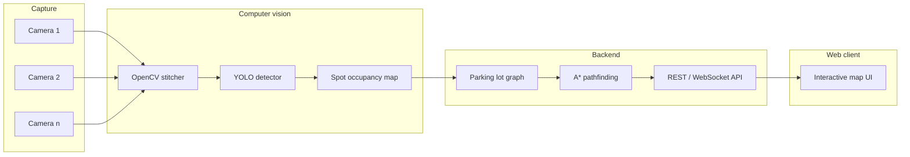

# SMART_PARK

Find available parking spots in a lot using computer vision, then guide drivers to an open space with pathfinding on an interactive map.

## Overview

SMART_PARK combines overhead (or elevated) camera imagery of a parking lot with object detection and graph-based routing. The pipeline:

1. **Capture** — Multiple images or video frames cover the lot from different viewpoints.
2. **Stitch** — Overlapping views are merged into one bird’s-eye panorama of the lot.
3. **Detect** — A trained model labels each region as **occupied** (parked car) or **free** (open spot).
4. **Route** — A pathfinding algorithm computes a walkable/drivable path from an entrance (or the user’s location) to a chosen free spot.
5. **Display** — A web app renders the lot map, spot availability, and the recommended path.

## Architecture



| Stage | Technology | Role |
|-------|------------|------|
| Image stitching | **OpenCV** (`cv2.Stitcher`), **NumPy**, **imutils** | Build a single panorama from overlapping camera images |
| Homography / calibration | **OpenCV** (`findHomography`, `warpPerspective`) | Optional manual or semi-automatic alignment (`manual_homography.py`) |
| Detection | **Ultralytics YOLO** + **OpenCV** | Train and run inference for classes such as `car` and `free_spot` |
| Occupancy grid | **NumPy** / **OpenCV** | Map detections to discrete parking cells on the stitched image |
| Pathfinding | **A\*** on a custom graph (e.g. **NetworkX** for prototyping) | Shortest path from entry → target free spot along drivable lanes |
| API | **FastAPI** | Serve panorama metadata, spot status, and computed routes |
| Frontend | **React** + **TypeScript** (Vite) | Canvas or SVG overlay for spots, availability, and path animation |

### Why A\*?

Parking lots are naturally modeled as a **graph**: nodes are lane junctions, aisle endpoints, and spot access points; edges are drivable segments with weights (distance, one-way rules, etc.). **A\*** is a strong default: it returns an optimal path when the heuristic is admissible (e.g. Euclidean distance to the goal), and it is much faster than Dijkstra on large lots because it searches toward the destination. Alternatives like Dijkstra or breadth-first search remain valid if you later drop heuristics or need unweighted exploration.

## Project status

| Component | Status |
|-----------|--------|
| Panorama stitching | In progress — `image_stitching_panorama.py` |
| Post-stitch crop / cleanup | In progress — fast downscale + contour crop |
| Manual homography | Planned — `manual_homography.py` |
| YOLO dataset & training | Planned |
| Lot graph + A\* routing | Planned |
| Web app | Planned |

## Repository layout

```
SMART_PARK/
├── image_stitching_panorama.py   # Stitch images → panorama + cropped output
├── manual_homography.py            # (planned) Point-pair homography alignment
├── unstitchedImages/               # Sample image set (4 views)
├── unstitchedImages2/
├── unstitchedImages3/              # Default input for stitching script
├── stitchedOutput.png              # Raw stitch output
├── StitchedOutputProcessed.png     # Cropped / cleaned panorama
└── README.md
```

## Prerequisites

- **Python 3.10+** (3.11 or 3.12 recommended)
- **Node.js 18+** (for the web client, when added)
- A GPU is optional but speeds up YOLO training and inference

## Setup

### 1. Python environment

```bash
python -m venv venv

# Windows
venv\Scripts\activate

# macOS / Linux
source venv/bin/activate

pip install --upgrade pip
pip install opencv-python numpy imutils ultralytics networkx fastapi uvicorn
```

For development without GUI windows (e.g. CI or headless servers), use `opencv-python-headless` instead of `opencv-python`.

Consider pinning dependencies:

```bash
pip freeze > requirements.txt
```

### 2. Image stitching (current workflow)

1. Place overlapping photos of the lot in a folder (default: `unstitchedImages3/`).
2. Update the glob path in `image_stitching_panorama.py` if you use another folder.
3. Run:

```bash
python image_stitching_panorama.py
```

Outputs:

- `stitchedOutput.png` — full panorama from `cv2.Stitcher`
- `StitchedOutputProcessed.png` — cropped to remove black borders (fast downscaled contour method)

The stitcher exposes resolution knobs (`setRegistrationResol`, `setSeamEstimationResol`) to balance quality, speed, and memory on large images.

### 3. Detection (planned)

1. **Collect data** — Frames or stills from the stitched (or raw) views, labeled in a tool such as [CVAT](https://www.cvat.ai/) or [Roboflow](https://roboflow.com/).
2. **Classes** — At minimum: `car` (occupied) and `free_spot` (or `empty`), aligned with how spots appear from your camera angle.
3. **Train** — Ultralytics YOLO (e.g. YOLOv8 / YOLO11):

```bash
yolo detect train data=parking.yaml model=yolo11n.pt epochs=100 imgsz=640
```

4. **Infer** — Run on the panorama or per-camera frames, then aggregate detections into a lot-wide occupancy grid (OpenCV for masks, NMS, and drawing).

```bash
yolo detect predict model=runs/detect/train/weights/best.pt source=stitchedOutput.png
```

### 4. Pathfinding (planned)

1. Define a **graph** over the lot (JSON or Python): nodes, edges, which nodes correspond to spots, and entrance node(s).
2. Mark nodes/spots **blocked** when detection says they are occupied.
3. Run **A\*** from the user’s start node to the nearest free spot node (or a user-selected spot).
4. Return the node sequence to the API for the frontend to draw as a polyline on the map.

### 5. Web app (planned)

- **Backend**: FastAPI endpoints such as `GET /lot/status`, `POST /route?spot_id=…`, optional WebSocket for live camera updates.
- **Frontend**: React map component over the stitched image; green/red spots; highlighted path; optional “navigate to nearest free spot” action.

## Configuration tips

| Concern | Suggestion |
|---------|------------|
| Stitch fails / few keypoints | More overlap between images; consistent exposure; lower `setRegistrationResol` carefully |
| Large panoramas / OOM | Lower registration and seam resolution (as in the script); stitch at lower resolution then upscale for display only |
| Detection drift | Retrain with lot-specific images; include time-of-day and weather variation |
| Path looks wrong | Refine the graph (one-way aisles, illegal cuts across spots); weight edges by distance |

## Roadmap

- [ ] Finalize stitching and homography for a stable top-down map
- [ ] Label dataset and train YOLO model for `car` / `free_spot`
- [ ] Map detections → parking spot IDs on the panorama
- [ ] Build lot graph and A\* pathfinding module
- [ ] FastAPI service + React client with live availability and routing
- [ ] Optional: RTSP camera ingest and periodic re-stitch / re-detect

## Contributing

1. Fork the repo and create a branch for your change.
2. Keep Python tooling in a virtual environment; do not commit `venv/`.
3. Open a pull request with a short description of what you tested (e.g. stitch on `unstitchedImages3`, sample detections).

## License

License TBD. Add a `LICENSE` file when you choose one.
