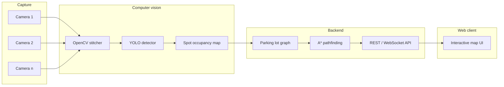

# SMART_PARK

Find available parking spots in a lot using computer vision, then guide drivers to an open space with pathfinding on an interactive map.

> [SmartPark Ideaboard](https://www.tldraw.com/f/RLgCVKEbHXMaHdycuMuwp?d=v337.-8.1762.1186.page)

## Overview

SMART_PARK combines overhead (or elevated) camera imagery of a parking lot with object detection and graph-based routing. The pipeline:

1. **Capture** — Multiple images or video frames cover the lot from different viewpoints.
2. **Stitch** — Overlapping views are merged into one bird’s-eye panorama of the lot.
3. **Detect** — A trained model labels each region as **occupied** (parked car) or **free** (open spot).
4. **Route** — A pathfinding algorithm computes a walkable/drivable path from an entrance (or the user’s location) to a chosen free spot.
5. **Display** — A web app renders the lot map, spot availability, and the recommended path.

## Architecture


```mermaid
flowchart LR
  subgraph capture [Capture]
    C1[Camera 1]
    C2[Camera 2]
    Cn[Camera n]
  end

  subgraph cv [Computer vision]
    ST[OpenCV stitcher]
    YOLO[YOLO detector]
    MAP[Spot occupancy map]
  end

  subgraph backend [Backend]
    GRAPH[Parking lot graph]
    ASTAR["A* pathfinding"]
    API[REST / WebSocket API]
  end

  subgraph client [Web client]
    UI[Interactive map UI]
  end

  C1 --> ST
  C2 --> ST
  Cn --> ST
  ST --> YOLO
  YOLO --> MAP
  MAP --> GRAPH
  GRAPH --> ASTAR
  ASTAR --> API
  API --> UI
```

| Stage | Technology | Role | Status |
|-------|------------|------|--------|
| Image stitching | **OpenCV** (`cv2.Stitcher`), **NumPy**, **imutils** | Build a single panorama from overlapping camera images | Done |
| Homography / calibration | **OpenCV** (`findHomography`, `warpPerspective`) | Marker-based alignment (`rectify_and_stitch.py`, pickers) | Done (needs tuning) |
| Detection (demo) | **OpenCV** heuristics | Grid-based spot occupancy on sample lot images | Done |
| Detection (production) | **Ultralytics YOLO** + **OpenCV** | Train and run inference for classes such as `car` and `free_spot` | Planned |
| Occupancy grid | **NumPy** / **OpenCV** | Map detections to discrete parking cells on the stitched image | Done (demo) |
| Pathfinding | **A\*** on a custom graph | Shortest path from vehicle → target free spot along drivable lanes | Done |
| API | **FastAPI** | Serve panorama metadata, spot status, and computed routes | Planned |
| Frontend | **HTML/CSS/JS** (`web/`) | Canvas overlay for spots, availability, and path animation | Done (prototype) |
| Frontend (production) | **React** + **TypeScript** (Vite) | Polished client with live updates | Planned |

### Why A\*?

Parking lots are naturally modeled as a **graph**: nodes are lane junctions, aisle endpoints, and spot access points; edges are drivable segments with weights (distance, one-way rules, etc.). **A\*** is a strong default: it returns an optimal path when the heuristic is admissible (e.g. Euclidean distance to the goal), and it is much faster than Dijkstra on large lots because it searches toward the destination. Alternatives like Dijkstra or breadth-first search remain valid if you later drop heuristics or need unweighted exploration.

## Project status

| Component | Status |
|-----------|--------|
| Panorama stitching | **Done** — `image_stitching_panorama.py` |
| Post-stitch crop / cleanup | **Done** — fast downscale + contour crop in `image_stitching_panorama.py` |
| Manual homography alignment | **Done** — `rectify_and_stitch.py`, `point_picker.py`, `side_by_side_picker.py`, `brute_force.py` |
| Heuristic spot classification (demo) | **Done** — `parking_classifier.py` (3 sample lots in `tempImages/`) |
| Lot graph generation | **Done** — `parking_classifier.py` → `data/lots/*.json` |
| A\* routing | **Done** — `web/app.js` (nearest-free + spot-to-vehicle paths) |
| Dijkstra prototype | **Done** — `graph_maker.py` (toy graph; not wired to lot JSON yet) |
| Web map UI (prototype) | **Done** — `web/`, `serve_parking.py` |
| YOLO dataset & training | Planned |
| Bbox center → spot/node mapping | Planned |
| FastAPI backend | Planned |
| React + TypeScript client | Planned |
| Stable top-down map (production) | In progress — homography warping still needs tuning |

## Repository layout

```
SMART_PARK/
├── image_stitching_panorama.py   # Stitch images → panorama + cropped output
├── rectify_and_stitch.py         # Homography warp + blend (marker-based)
├── point_picker.py               # Click markers on a single image
├── side_by_side_picker.py        # Click matching marker pairs across two images
├── parking_classifier.py         # Grid spots, heuristic occupancy, graph JSON
├── graph_maker.py                # Standalone Dijkstra demo
├── serve_parking.py              # Static server for the web map
├── web/                          # Interactive map UI (HTML/CSS/JS + A*)
├── data/lots/                    # Generated lot graphs + spot status
├── data/previews/                # Classified lot preview images
├── tempImages/                   # Sample parking lot images
├── refImages/                    # Wireframe / graph reference diagrams
├── unstitchedImages/             # Sample image sets for stitching
├── unstitchedImages2/
├── unstitchedImages3/            # Default input for stitching script
├── stitchedOutput.png            # Raw stitch output
├── StitchedOutputProcessed.png   # Cropped / cleaned panorama
└── README.md
```

## Prerequisites

- **Python 3.10+** (3.11 or 3.12 recommended)
- **Node.js 18+** (only if you add the planned React client)
- A GPU is optional but speeds up YOLO training and inference

## Setup

### 1. Python environment

```bash
python -m venv venv

# Windows
venv\Scripts\activate

# macOS / Linux
source venv/bin/activate

pip install --upgrade pip
pip install opencv-python numpy imutils ultralytics networkx fastapi uvicorn
```

For development without GUI windows (e.g. CI or headless servers), use `opencv-python-headless` instead of `opencv-python`.

Consider pinning dependencies:

```bash
pip freeze > requirements.txt
```

### 2. Image stitching (current workflow)

1. Place overlapping photos of the lot in a folder (default: `unstitchedImages3/`).
2. Update the glob path in `image_stitching_panorama.py` if you use another folder.
3. Run:

```bash
python image_stitching_panorama.py
```

Outputs:

- `stitchedOutput.png` — full panorama from `cv2.Stitcher`
- `StitchedOutputProcessed.png` — cropped to remove black borders (fast downscaled contour method)

The stitcher exposes resolution knobs (`setRegistrationResol`, `setSeamEstimationResol`) to balance quality, speed, and memory on large images.

### 3. Detection

**Demo (done):** run heuristic classification on the sample lots and regenerate JSON:

```bash
python parking_classifier.py
```

**YOLO (planned):**

1. **Collect data** — Frames or stills from the stitched (or raw) views, labeled in a tool such as [CVAT](https://www.cvat.ai/) or [Roboflow](https://roboflow.com/).
2. **Classes** — At minimum: `car` (occupied) and `free_spot` (or `empty`), aligned with how spots appear from your camera angle.
3. **Train** — Ultralytics YOLO (e.g. YOLOv8 / YOLO11):

```bash
yolo detect train data=parking.yaml model=yolo11n.pt epochs=100 imgsz=640
```

4. **Infer** — Run on the panorama or per-camera frames, then aggregate detections into a lot-wide occupancy grid (OpenCV for masks, NMS, and drawing).

```bash
yolo detect predict model=runs/detect/train/weights/best.pt source=stitchedOutput.png
```

### 4. Pathfinding

**Done (demo):**

1. `parking_classifier.py` builds a **graph** per lot (nodes, edges, spot nodes, vehicle anchor) and writes `data/lots/*.json`.
2. Occupied spots are marked in that JSON from classification (heuristic today; YOLO later).
3. `web/app.js` runs **A\*** for nearest-free routing and spot-to-vehicle routing on the canvas.

**Planned:** expose routing via a FastAPI endpoint instead of client-side only.

### 5. Web app

**Done (prototype):**

```bash
python serve_parking.py
```

Open `http://127.0.0.1:8080/web/` — lot selector, occupancy overlay, road nodes, orange route to nearest free spot, green route to a selected spot.

**Planned:**

- **Backend**: FastAPI endpoints such as `GET /lot/status`, `POST /route?spot_id=…`, optional WebSocket for live camera updates.
- **Frontend**: React + TypeScript (Vite) client to replace the vanilla `web/` prototype.

## Configuration tips

| Concern | Suggestion |
|---------|------------|
| Stitch fails / few keypoints | More overlap between images; consistent exposure; lower `setRegistrationResol` carefully |
| Large panoramas / OOM | Lower registration and seam resolution (as in the script); stitch at lower resolution then upscale for display only |
| Detection drift | Retrain with lot-specific images; include time-of-day and weather variation |
| Path looks wrong | Refine the graph (one-way aisles, illegal cuts across spots); weight edges by distance |

## Roadmap

- [ ] Finalize stitching and homography for a stable top-down map
- [ ] Label dataset and train YOLO model for `car` / `free_spot`
- [ ] Map YOLO bounding-box centers → parking spot / graph nodes
- [x] Heuristic spot classification for demo lots (`parking_classifier.py`)
- [x] Build lot graph and A\* pathfinding module
- [x] Interactive web map with availability and routing (`web/`, `serve_parking.py`)
- [ ] FastAPI service + React client with live availability and routing
- [ ] Optional: RTSP camera ingest and periodic re-stitch / re-detect

## Contributing

1. Fork the repo and create a branch for your change.
2. Keep Python tooling in a virtual environment; do not commit `venv/`.
3. Open a pull request with a short description of what you tested (e.g. stitch on `unstitchedImages3`, sample detections).

## License

License TBD. Add a `LICENSE` file when you choose one.
