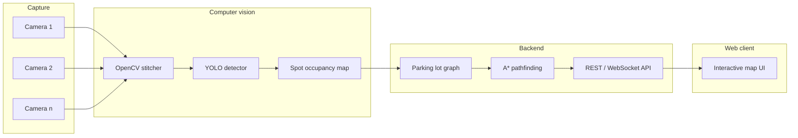
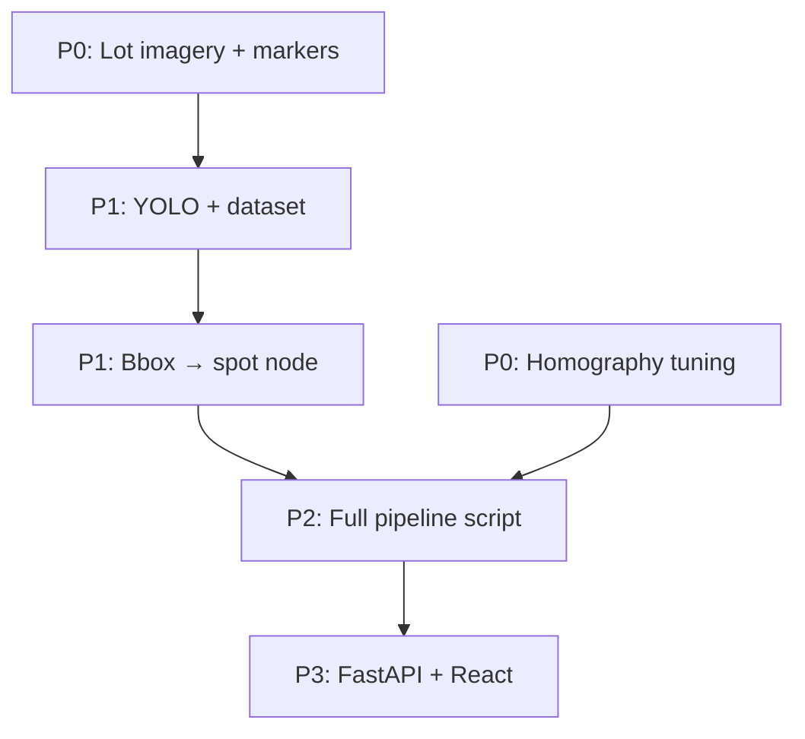

# SMART_PARK

Find available parking spots in a lot using computer vision, then guide drivers to an open space with pathfinding on an interactive map.

> [SmartPark Ideaboard](https://www.tldraw.com/f/RLgCVKEbHXMaHdycuMuwp?d=v337.-8.1762.1186.page)

## What the system does

SMART_PARK combines overhead (or elevated) camera imagery of a parking lot with object detection and graph-based routing. The intended pipeline is:

1. **Capture** — Multiple images or video frames cover the lot from different viewpoints.
2. **Stitch** — Overlapping views are merged into one bird's-eye panorama of the lot.
3. **Detect** — A trained model labels each region as **occupied** (parked car) or **free** (open spot).
4. **Route** — A pathfinding algorithm computes a drivable path from an entrance (or the user's location) to a chosen free spot.
5. **Display** — A web app renders the lot map, spot availability, and the recommended path.

## Architecture


```mermaid
flowchart LR
  subgraph capture [Capture]
    C1[Camera 1]
    C2[Camera 2]
    Cn[Camera n]
  end

  subgraph cv [Computer vision]
    ST[OpenCV stitcher]
    YOLO[YOLO detector]
    MAP[Spot occupancy map]
  end

  subgraph backend [Backend]
    GRAPH[Parking lot graph]
    ASTAR["A* pathfinding"]
    API[REST / WebSocket API]
  end

  subgraph client [Web client]
    UI[Interactive map UI]
  end

  C1 --> ST
  C2 --> ST
  Cn --> ST
  ST --> YOLO
  YOLO --> MAP
  MAP --> GRAPH
  GRAPH --> ASTAR
  ASTAR --> API
  API --> UI
```

| Stage | Technology | Role | Status |
|-------|------------|------|--------|
| Image stitching | **OpenCV** (`cv2.Stitcher`), **NumPy**, **imutils** | Build a single panorama from overlapping camera images | Done |
| Homography / calibration | **OpenCV** (`findHomography`, `warpPerspective`) | Marker-based alignment (`rectify_and_stitch.py`, pickers) | Done (needs tuning) |
| Detection (demo) | **OpenCV** heuristics | Grid-based spot occupancy on sample lot images | Done |
| Detection (ML) | **Ultralytics YOLO** + **OpenCV** | Train and run inference for `vacant` / `occupied` | Done (mock lot) |
| Occupancy grid | **NumPy** / **OpenCV** | Map detections to discrete parking cells | In progress |
| Pathfinding | **Dijkstra** (Python), **A\*** (web demo) | Shortest path from vehicle → target free spot | Done |
| API | **FastAPI** | Serve panorama metadata, spot status, and computed routes | Planned |
| Frontend | **HTML/CSS/JS** (`web/`) | Canvas overlay for spots, availability, and path animation | Done (prototype) |
| Frontend (production) | **React** + **TypeScript** (Vite) | Polished client with live updates | Planned |

### Why A\*?

Parking lots are naturally modeled as a **graph**: nodes are lane junctions, aisle endpoints, and spot access points; edges are drivable segments with weights (distance, one-way rules, etc.). **A\*** is a strong default: it returns an optimal path when the heuristic is admissible (e.g. Euclidean distance to the goal), and it is much faster than Dijkstra on large lots because it searches toward the destination.

## Project status

| Component | Status |
|-----------|--------|
| Panorama stitching | **Done** — `scripts/stitching/image_stitching_panorama.py` |
| Post-stitch crop / cleanup | **Done** — fast downscale + contour crop in stitcher |
| Manual homography alignment | **Done** — `scripts/stitching/rectify_and_stitch.py`, calibration pickers |
| YOLO dataset (mock lot) | **Done** — `moc_parking_lot_datatset/` |
| YOLO training | **Done** — `runs/detect/train-10/weights/best.pt` |
| YOLO inference | **Done** — `scripts/detection/testing_spot_detector.py` |
| Bbox centre → graph node mapping | **Done** — `scripts/detection/complete_parking_spot_detection_system.py` |
| Path overlay on detection image | **Done** — same script → `runs/detect/predict/path_overlay.png` |
| Dijkstra on mock lot graph | **Done** — `scripts/pathfinding/graph_maker.py` |
| Pygame lot visualizer | **Done** — `scripts/pathfinding/parking_lot_render.py` |
| Heuristic spot classification (demo) | **Done** — `scripts/detection/parking_classifier.py` |
| Lot graph generation | **Done** — `parking_classifier.py` → `data/lots/*.json` |
| A\* routing | **Done** — `web/app.js` (when `web/` is present) |
| Web map UI (prototype) | **Done** — `web/`, `scripts/server/serve_parking.py` |
| End-to-end stitch → detect pipeline | **In progress** |
| FastAPI backend | Planned |
| React + TypeScript client | Planned |
| Stable top-down map (production) | In progress — homography warping still needs tuning |

## What was done (recent ML + routing work)

- Trained YOLO11 on the mock parking lot dataset (classes: `vacant=0`, `occupied=1`).
- Calculated accuracy/error between bounding-box centres and node coordinates.
- Matched centres of **vacant spots only** (`class_id = 0`) to the closest graph node within a pixel tolerance.
- Passed matched vacant nodes into `vacant_spot_set` and ran Dijkstra pathfinding — **works**.
- Drew the shortest-path nodes and edges directly onto the inference image (green = start, red = goal, yellow = intermediate).
- Output: `runs/detect/predict/path_overlay.png`.

## Repository layout

```
SMART_PARK/
├── scripts/
│   ├── calibration/              # Click markers, homography experiments
│   │   ├── point_picker.py
│   │   ├── side_by_side_picker.py
│   │   └── brute_force.py
│   ├── detection/                # Spot classification and YOLO pipeline
│   │   ├── complete_parking_spot_detection_system.py
│   │   ├── parking_classifier.py
│   │   ├── training_spot_detector.py
│   │   └── testing_spot_detector.py
│   ├── pathfinding/              # Graph, Dijkstra, Pygame visualizer
│   │   ├── graph_maker.py
│   │   └── parking_lot_render.py
│   ├── server/
│   │   └── serve_parking.py
│   └── stitching/                # Panorama and homography warp
│       ├── image_stitching_panorama.py
│       └── rectify_and_stitch.py
├── moc_parking_lot_datatset/     # YOLO train/val/test images + labels
├── runs/detect/                  # Training runs; best weights at train-10/
├── web/                          # Interactive map UI (HTML/CSS/JS + A*)
├── data/lots/                    # Generated lot graphs
├── data/previews/                # Classified lot preview images
├── tempImages/                   # Sample parking lot images
├── refImages/                    # Wireframe / graph reference diagrams
├── unstitchedImages/             # Sample image sets for stitching
├── unstitchedImages2/
├── unstitchedImages3/            # Default input for stitching script
├── stitchedOutput.png            # Raw stitch output (generated)
├── StitchedOutputProcessed.png   # Cropped panorama (generated)
├── system_overview.txt           # Plain-text system reference
├── README.md                     # This file
└── requirements.txt
```

## Prerequisites

- **Python 3.10+** (3.11 or 3.12 recommended)
- **Node.js 18+** (only if you add the planned React client)
- A GPU is optional but speeds up YOLO training and inference

## Setup

### 1. Python environment

```bash
python -m venv venv

# Windows
venv\Scripts\activate

# macOS / Linux
source venv/bin/activate

pip install --upgrade pip
pip install -r requirements.txt
```

For development without GUI windows (e.g. CI or headless servers), use `opencv-python-headless` instead of `opencv-python`.

### 2. Quick demo (run from repo root)

```bash
# Heuristic classification + lot JSON (needs tempImages/)
python scripts/detection/parking_classifier.py

# YOLO inference on a test image
python scripts/detection/testing_spot_detector.py

# Full detect → map nodes → Dijkstra → draw path overlay
python scripts/detection/complete_parking_spot_detection_system.py

# Stitch overlapping photos (default: unstitchedImages3/)
python scripts/stitching/image_stitching_panorama.py

# Serve web map (needs web/ and data/lots/)
python scripts/server/serve_parking.py
# → http://127.0.0.1:8080/web/
```

### 3. Image stitching

1. Place overlapping photos of the lot in a folder (default: `unstitchedImages3/`).
2. Update the glob path in `scripts/stitching/image_stitching_panorama.py` if you use another folder.
3. Run the stitcher (see commands above).

Outputs:

- `stitchedOutput.png` — full panorama from `cv2.Stitcher`
- `StitchedOutputProcessed.png` — cropped to remove black borders

### 4. Detection

**Demo (heuristic):** run classification on sample lots and regenerate JSON:

```bash
python scripts/detection/parking_classifier.py
```

**YOLO (mock lot, trained):**

```bash
python scripts/detection/training_spot_detector.py   # uncomment train block
python scripts/detection/testing_spot_detector.py
python scripts/detection/complete_parking_spot_detection_system.py
```

Classes in `moc_parking_lot_datatset/dataset_config.yaml`: `0 = vacant`, `1 = occupied`.

### 5. Pathfinding

**Done (mock lot pipeline):**

1. `graph_maker.py` defines the mock 8-spot lot graph and Dijkstra search.
2. `complete_parking_spot_detection_system.py` maps YOLO vacant detections to nodes, runs Dijkstra, and draws the path.

**Done (demo lots):**

1. `parking_classifier.py` builds a graph per lot and writes `data/lots/*.json`.
2. `web/app.js` runs **A\*** for nearest-free and spot-to-vehicle routing on the canvas.

**Planned:** expose routing via a FastAPI endpoint.

## Configuration tips

| Concern | Suggestion |
|---------|------------|
| Stitch fails / few keypoints | More overlap between images; consistent exposure; lower `setRegistrationResol` carefully |
| Large panoramas / OOM | Lower registration and seam resolution; stitch at lower resolution then upscale for display only |
| Detection drift | Retrain with lot-specific images; include time-of-day and weather variation |
| Path looks wrong | Refine the graph (one-way aisles, illegal cuts across spots); verify node pixel mapping |

## Done

- [x] Panorama stitching → `stitchedOutput.png`, `StitchedOutputProcessed.png`
- [x] Post-stitch crop (fast downscale + contour crop)
- [x] Marker-based homography tools (`rectify_and_stitch`, pickers, `brute_force`)
- [x] Heuristic spot classification for demo lots (`parking_classifier.py`)
- [x] Lot graph JSON generation (`data/lots/*.json`)
- [x] A\* routing in the web UI (`web/app.js`)
- [x] Interactive web map prototype (`web/`, `serve_parking.py`)
- [x] Standalone Dijkstra demo on mock lot graph (`graph_maker.py`)
- [x] YOLO training on mock parking lot dataset
- [x] Bbox centre → vacant node matching + path overlay on image
- [x] Repository scripts reorganized under `scripts/`

## To do

### P0: Lot imagery and calibration

- [ ] Retake reference image with new pins
- [ ] Add markers for **centre of parking spots** and **outside of spots**
- [ ] Draw parking spots (pencil / art pass) so the lot looks realistic
- [ ] Tune `pts_dst` in `scripts/stitching/rectify_and_stitch.py` until warped views are not slanted
- [ ] Populate `unstitchedImages3/` (or update stitcher glob) for your real camera set

### P1: ML detection pipeline

- [ ] Expand training beyond mock dataset (e.g. [PKLot](https://www.kaggle.com/datasets/ammarnassanalhajali/pklot-dataset) or lot-specific labels)
- [ ] Run inference on stitched panorama, not just single test frames
- [ ] Replace heuristic grid + `status_overrides` in `parking_classifier.py` with model output
- [ ] Remove manual `status_overrides` for `parking-lot-2` and `parking-lot-3` once detection is reliable
- [ ] Tune bbox-centre → node matching tolerance

### P2: End-to-end integration

Wire the isolated pieces into one pipeline:

```
Camera images → stitch → detect → map to spots → update JSON → web UI
```

- [ ] Script or module to run stitch + detect + `data/lots/*.json` refresh in one step
- [ ] Optionally wire `graph_maker.py` Dijkstra to real lot JSON (A\* already covers routing in `web/app.js`)
- [ ] Optional: periodic re-detect loop for live occupancy updates

### P3: Production backend and UI

- [ ] FastAPI service (`GET /lot/status`, `POST /route`, optional WebSocket)
- [ ] Move routing off the client or mirror it in the API
- [ ] React + TypeScript (Vite) client (replace vanilla `web/` prototype)
- [ ] Optional: RTSP camera ingest

### P4: Project hygiene

- [ ] Expand `requirements.txt` with pinned versions for all runtime deps
- [ ] Choose and add a `LICENSE`
- [ ] Keep `system_overview.txt` and `README.md` in sync

## Suggested order


```mermaid
flowchart TD
  A[P0: Lot imagery + markers] --> B[P1: YOLO + dataset]
  B --> C[P1: Bbox → spot node]
  C --> D[P2: Full pipeline script]
  D --> E[P3: FastAPI + React]
  F[P0: Homography tuning] --> D
```

1. **P0** — Better source imagery unblocks everything downstream.
2. **P1** — Biggest functional gap: real occupancy on camera imagery.
3. **P2** — Connect stitch → detect → JSON → map without manual steps.
4. **P3** — Production API and UI when the vision pipeline is stable.
5. **P4** — Can be done in parallel anytime.

## Notes

| Topic | Detail |
|-------|--------|
| Routing | **A\*** on real lot graphs is live in `web/app.js` when `web/` is present. `graph_maker.py` Dijkstra is wired into `complete_parking_spot_detection_system.py` but not yet connected to `data/lots/*.json`. |
| Classification | Demo uses colour/texture heuristics on a fixed grid; lots 2–3 may still need `status_overrides` in `parking_classifier.py`. |
| Homography | Implemented via picker scripts + `rectify_and_stitch.py`; production top-down map still needs tuning. |
| Docs | `system_overview.txt` is the plain-text reference; this README is the markdown version. |

## Contributing

1. Fork the repo and create a branch for your change.
2. Keep Python tooling in a virtual environment; do not commit `venv/`.
3. Open a pull request with a short description of what you tested.

## License

License TBD. Add a `LICENSE` file when you choose one.
