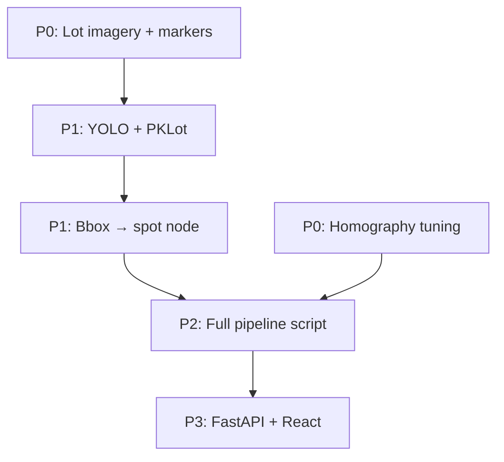

# Next tasks

Actionable backlog for SMART_PARK. See [README.md](README.md) for setup and architecture.

**Demo today:**

```bash
python parking_classifier.py
python serve_parking.py
# → http://127.0.0.1:8080/web/
```

---

## Done

- [x] Panorama stitching (`image_stitching_panorama.py` → `stitchedOutput.png`, `StitchedOutputProcessed.png`)
- [x] Post-stitch crop (fast downscale + contour crop)
- [x] Marker-based homography (`rectify_and_stitch.py`, `point_picker.py`, `side_by_side_picker.py`, `brute_force.py`)
- [x] Heuristic spot classification for 3 demo lots (`parking_classifier.py`)
- [x] Lot graph JSON generation (`data/lots/*.json`)
- [x] A\* routing in the web UI (`web/app.js` — nearest free + spot-to-vehicle)
- [x] Interactive web map prototype (`web/`, `serve_parking.py`)
- [x] Standalone Dijkstra demo on a toy graph (`graph_maker.py`)
- [x] README project status updated

---

## To do

### P0: Lot imagery and calibration

From [system_overview.md](system_overview.md):

- [ ] Retake reference image with new pins
- [ ] Add markers for **centre of parking spots** and **outside of spots**
- [ ] Draw parking spots (pencil / art pass) so the lot looks realistic
- [ ] Tune `pts_dst` in `rectify_and_stitch.py` until warped views are not slanted
- [ ] Populate `unstitchedImages3/` (or update stitcher glob) for your real camera set

### P1: ML detection pipeline

- [ ] Add `parking.yaml` and Ultralytics training workflow
- [ ] Train or fine-tune YOLO on [PKLot](https://www.kaggle.com/datasets/ammarnassanalhajali/pklot-dataset) (or lot-specific labels)
- [ ] Add inference script: run model on panorama / camera frames
- [ ] Implement **bounding-box centre → nearest spot / graph node** mapping
- [ ] Replace heuristic grid + `status_overrides` in `parking_classifier.py` with model output
- [ ] Remove manual `status_overrides` for `parking-lot-2` and `parking-lot-3` once detection is reliable

### P2: End-to-end integration

Wire the isolated pieces into one pipeline:

```
Camera images → stitch → detect → map to spots → update JSON → web UI
```

- [ ] Script or module to run stitch + detect + `data/lots/*.json` refresh in one step
- [ ] Optionally wire `graph_maker.py` Dijkstra to real lot JSON (A\* already covers routing in `web/app.js`; only needed for server-side or comparison)
- [ ] Optional: periodic re-detect loop for live occupancy updates

### P3: Production backend and UI

- [ ] FastAPI service (`GET /lot/status`, `POST /route`, optional WebSocket)
- [ ] Move routing off the client or mirror it in the API
- [ ] React + TypeScript (Vite) client (replace vanilla `web/` prototype)
- [ ] Optional: RTSP camera ingest

### P4: Project hygiene

- [ ] Expand `requirements.txt` (pin `opencv-python`, `numpy`, `imutils`; add `ultralytics`, `fastapi`, `uvicorn`, etc. when used)
- [ ] Add `venv/` and other ignores to `.gitignore`
- [ ] Choose and add a `LICENSE`
- [ ] Keep `system_overview.md` in sync or fold its bullets into this file

---

## Suggested order



1. **P0** — Better source imagery unblocks everything downstream.
2. **P1** — Biggest functional gap: real occupancy on camera imagery.
3. **P2** — Connect stitch → detect → JSON → map without manual steps.
4. **P3** — Production API and UI when the vision pipeline is stable.
5. **P4** — Can be done in parallel anytime.

---

## Notes

| Topic | Detail |
|-------|--------|
| Routing | **A\*** on real lot graphs is live in `web/app.js`. `graph_maker.py` is a separate Dijkstra exercise, not connected to `data/lots/*.json`. |
| Classification | Demo uses colour/texture heuristics on a fixed grid; lots 2–3 still need `status_overrides` in `parking_classifier.py`. |
| Homography | Implemented via picker scripts + `rectify_and_stitch.py`; production top-down map still needs tuning. |
| Docs | README reflects current done vs planned status; this file is the working backlog. |
